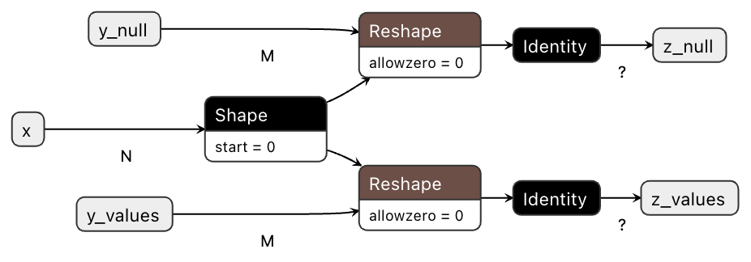

Inference Utilities
===================

ndonnx addresses the challenge of converting models naturally expressed using arrays into ONNX.
It provides a relatively high level API and exposes complex data types like nullable integers that aren't actually present in the ONNX standard through library-level abstractions.

Seeing an ONNX graph
--------------------
Let's see how a simple reshape operation gets expressed in the ONNX graph exported by ndonnx.
Note that we're mixing nullable and non-nullable data types in this example.

.. code-block:: python

    import ndonnx as ndx
    import onnx

    x = ndx.argument(shape=("N",), dtype=ndx.utf8)
    y = ndx.argument(shape=("M",), dtype=ndx.nutf8)
    z = ndx.reshape(y, x.shape)

    model = ndx.build({"x": x, "y": y}, {"z": z})
    onnx.save(model, "reshape.onnx")

We can visualize the model using Netron:

Why do we have three inputs?
~~~~~~~~~~~~~~~~~~~~~~~~~~~~
We end up with ``x``, ``y_values`` and ``y_null`` as inputs to the ONNX graph, even though only ``x`` and ``y`` were provided to :func:`ndonnx.build`.

This comes from the fact that ``y`` has a nullable data type ``nutf8``. This is not present in the ONNX standard and is an abstraction provided by ndonnx to provide a more intuitive interface for dealing with missing data.
ndonnx implements this abstraction by composing a ``values`` and ``null`` mask array, which is decomposed into ``y_values`` and ``y_null`` when exporting to ONNX.

.. note::

    :func:`ndonnx.Array.values` and :func:`ndonnx.Array.null` may be used to access these components.

    .. code-block:: python

        y = ndx.argument(shape=("N",), dtype=ndx.nutf8)
        print(y) # Array(dtype=NUtf8)
        print(y.values) # Array(dtype=Utf8)
        print(y.null) # Array(dtype=Boolean)

The suffixes ``_values`` and ``_null`` are not present when using standard :doc:`"core" data types <../datatypes/datatypes>` found in the ONNX standard.

Inspecting metadata
-------------------

To assist downstream packages, ndonnx includes metadata in the generated :class:`onnx.ModelProto`'s ``metadata_props`` field.
This includes a versioned JSON schema which documents the data type of each of the inputs and outputs.
This is by no means needed to run the model but can be useful for simplifying downstream inference code if you choose to use nullable data types.

For the example model above, we extract the following schema:

.. code-block:: json

    {
        "version": 1,
        "input_schema": {
            "x": {
                "type_name": "Utf8",
                "author": "ndonnx",
                "meta": null
            },
            "y": {
                "type_name": "NUtf8",
                "author": "ndonnx",
                "meta": null
            }
        },
        "output_schema": {
            "z": {
                "type_name": "NUtf8",
                "author": "ndonnx",
                "meta": null
            }
        }
    }

Since ndonnx strictly follows the versioning of the schema, downstream application code may choose to use this information to ensure incoming nullable input values are split into values and null fields and similarly combined for output values.
Inference code can be expressed at the same level of abstraction as the higher level data types provided by ndonnx.

.. note::

    Nullable data types are entirely opt-in in ndonnx. If you don't instantiate a nullable array you can safely expect not to produce one from a ndonnx function, unless explicitly a constructor.
