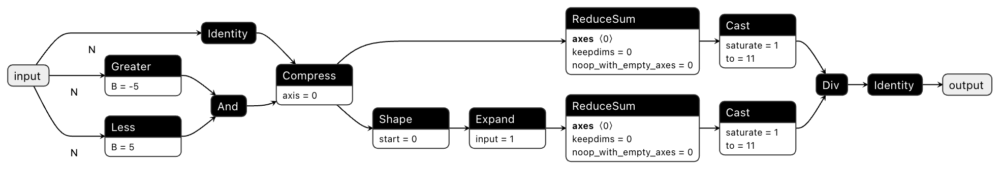

Getting Started
===============

This guide will go over the basic concepts of ndonnx and how to get started with the library.

Array Programming
-----------------

ndonnx will feel familiar to users of libraries like NumPy since it implements a superset of the Array API standard. The complete Array API specification can be found `elsewhere <https://data-apis.org/array-api/latest/API_specification/index.html>`_. Additional parts of the API specific to ndonnx are listed :doc:`here <../api/ndonnx.extensions>`.

Creating Arrays
~~~~~~~~~~~~~~~

ndonnx arrays can be instantiated from NumPy arrays, scalars or Python lists.
Unlike most other libraries, ndonnx arrays can also be created only from a shape and data type.
While these arrays don't contain any data, they are used to trace computation graphs to facilitate ONNX export.
This is discussed in more detail in the :ref:`onnx-export` section below.

..  code-block:: python

        import ndonnx as ndx

        # Initializing an array with data
        a = ndx.asarray([1, 2, 3])

        # Initializing an array with shape and data type
        b = ndx.argument(shape=(3,), dtype=ndx.float64)

        # Shapes can be symbolic using string dimensions
        c = ndx.argument(shape=("N", "M"), dtype=ndx.utf8)

The ndonnx namespace
~~~~~~~~~~~~~~~~~~~~

The top-level ``ndonnx`` namespace contains various functions such as `ndonnx.sum` that are mandated by the Array-API standard.
Additional functions that go beyond the standard may be found in the ``ndonnx.extensions`` module.

..  code-block:: python

        import ndonnx as ndx
        import ndonnx.extensions as nde

        a = ndx.asarray([1, 2, 3])

        # Functions and operators as defined by the Array API
        b = 1 / ndx.logaddexp(a, 2.0)
        print(b) # Array([0.44651931 0.37502795 0.3021017 ], dtype=Float64)

        # Functions unique to ndonnx
        c = nde.isin(a, [1, 3])
        print(c) # Array([True False True], dtype=Boolean)

Slicing, Indexing, and Broadcasting
~~~~~~~~~~~~~~~~~~~~~~~~~~~~~~~~~~~

Slicing, indexing and broadcasting is also defined by the Array-API standard and will thus feel familiar to NumPy users.

..  code-block:: python

        import ndonnx as ndx

        a = ndx.asarray([1, 2, 3])

        # Indexing
        b = a[0]
        print(b) # Array(1, dtype=Int64)

        # Slicing and broadcasting
        c = a[1:3] + 4
        print(c) # Array([6 7], dtype=Int64)

Data Types
~~~~~~~~~~

ndonnx provides not only Array API compliant data types but also strings and nullable variants. You can find a full list :doc:`here <../datatypes/datatypes>`.

..  code-block:: python

        import ndonnx as ndx
        import numpy as np

        a = ndx.asarray(["foo", "bar", "baz"])
        print(a.dtype) # Utf8

        # Array of nullable integers
        b = ndx.asarray(np.ma.masked_array([1, 2, 3], mask=[0, 1, 0]))
        print(b) # Array([1 -- 3], dtype=NInt64)

        # Mix and match nullable data types
        c = b + ndx.asarray([1, 2, 3])
        print(c) # Array([2 -- 6], dtype=NInt64)

Writing Array API compliant code
---------------------------------

Writing code in a strictly Array API compliant fashion makes it instantly reusable across many different array backend libraries like NumPy, JAX, PyTorch and now ndonnx.

.. code-block:: python

        import ndonnx as ndx
        import numpy as np

        def mean_drop_outliers(a, low=-5, high=5):
            xp = a.__array_namespace__()
            return xp.mean(a[(low < a) & (a < high)])

        np_result = mean_drop_outliers(np.asarray([-10, 0.5, 1, 4]))
        onnx_result = mean_drop_outliers(ndx.asarray([-10, 0.5, 1, 4]))
        np.testing.assert_equal(np_result, onnx_result.to_numpy())

.. _onnx-export:

ONNX Export
-----------

ndonnx arrays do not *need* to hold data. They can instead be instantiated with only a *shape* and *data type*.
This gives you the ability to persist the traced computation graph as an ONNX model and provide compatible input values only at inference time.

.. code-block:: python

        import ndonnx as ndx
        import onnx

        # Instantiate placeholder ndonnx array
        x = ndx.argument(shape=("N",), dtype=ndx.int64)
        y = mean_drop_outliers(x)

        # Build and save my ONNX model to disk
        model = ndx.build({"x": x}, {"y": y})
        onnx.save(model, "mean_drop_outliers.onnx")

We can visualize this model using `Netron <https://netron.app/>`_.

.. note::
    ndonnx will write versioned metadata in your ONNX model that may be used by downstream inference oriented libraries.
    You can find out more in the :doc:`Inference Utilities <../inference/inference>` section.
